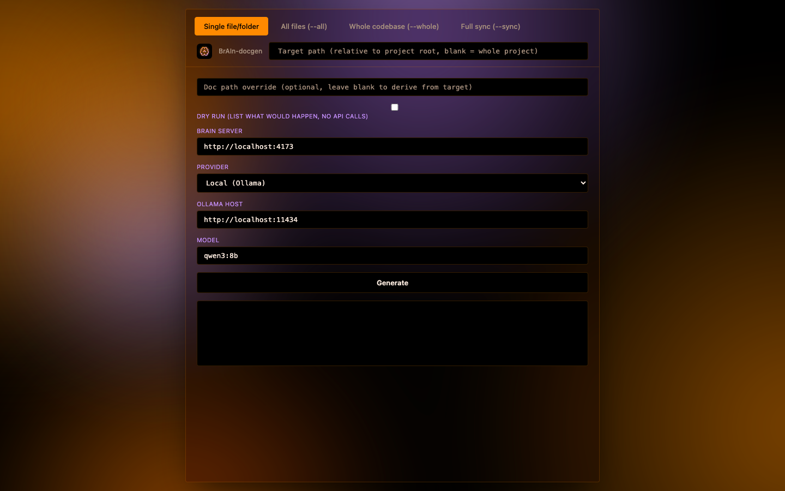
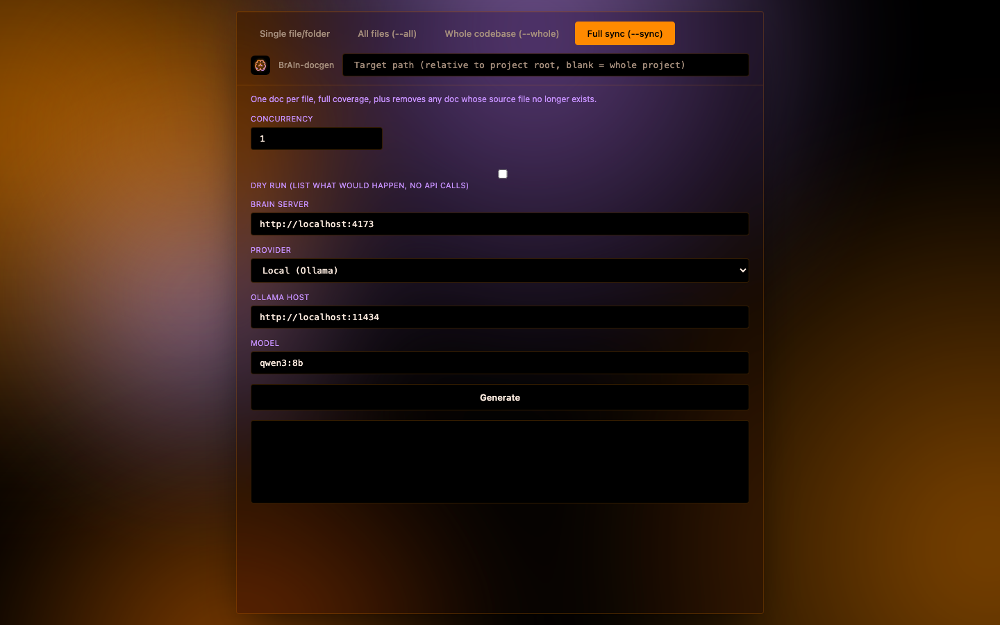

# brain-docgen — Interface Overview

`brain-docgen-gui` runs as a local web form (default `http://localhost:4174`), a thin front end over the `brain-docgen` CLI — every field here maps straight to a flag from the main README. It's copied from BrAIn's own GUI look: a single dark "glass" panel (near-black, blurred, hairline accent-colored border) over a slowly drifting ambient background, orange/purple instead of BrAIn's green/azure so the two tools stay visually distinct at a glance. The same brain mark BrAIn uses (recolored to match) sits next to the "BrAIn-docgen" label at the top of the panel, and doubles as the browser tab's favicon.

At the top, four mode tabs pick what `brain-docgen` actually does; the fields below change depending on which is active.

## Single file/folder (default)

The plain case: one target path, one generated doc. `Doc path override` lets you write somewhere other than the path `brain-docgen` would derive automatically.

**BrAIn server** is the target project's `brain --mode http` URL — not this tool's own address. **Provider** picks `local` (Ollama), `anthropic`, or `openai` (any OpenAI-compatible endpoint); the fields under it change to match — Ollama host, an API key, or a Base URL, depending. The **Model** field is `<input list>` + `<datalist>`: for Ollama it's populated live from `ollama_host/api/tags` (whatever's actually pulled), for Anthropic it's a short static list of current model IDs, and for an OpenAI-compatible endpoint a "Fetch models" button queries its `/models` endpoint — all three stay plain text fields too, so an unlisted model name still works.

## Full sync (--sync)

Switching to `--all`, `--whole`, or `--sync` swaps in mode-specific fields. Shown here: **Full sync**, which regenerates a doc per file *and* removes docs whose source file is gone. `--all`/`--sync` get a **Concurrency** field (generate several files in parallel) and a **Dry run** checkbox (list what would happen, no model calls or writes) — both shown here; `--whole` gets a **Max chars** field instead (how much source fits in the one combined prompt).

## Running

Hitting **Generate** streams the command's real stdout/stderr straight into the output pane below the button, live — the GUI server spawns the actual `brain-docgen` CLI as a child process, so there's no separate generation logic to keep in sync with the command line. `--all`/`--sync` show a live progress bar as files complete. A **Stop** button appears while a run is in progress, to cancel it early.

## Persistence and details

Non-secret fields (URLs, provider, model) are remembered per-browser via `localStorage`, so reopening the page picks up where you left off; API keys never are. The little "$ brain-docgen ..." line at the top of the output pane echoes the exact argv the click turned into — useful for copying a run into a script once you've got the settings right in the form.
